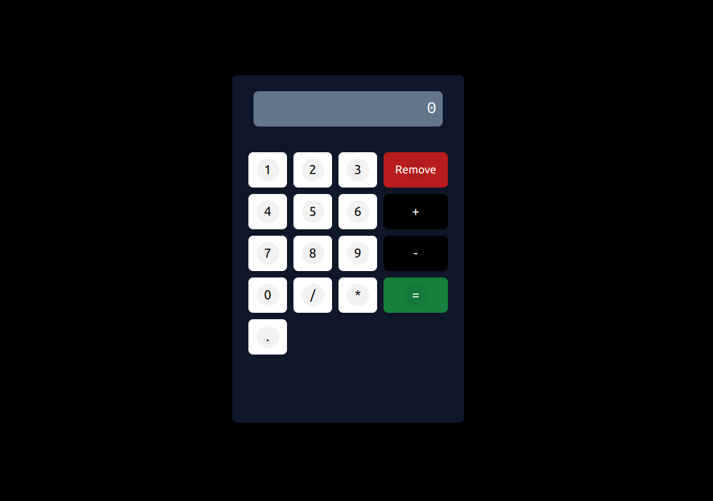

# Calculadora Simples

Uma calculadora simples desenvolvida com JavaScript, utilizando Programação Orientada a Objetos (POO), manipulação do DOM (Document Object Model) e estilização com Tailwind CSS.

## Visão Geral

Este projeto tem como objetivo criar uma calculadora básica que realiza operações aritméticas simples, como adição, subtração, multiplicação e divisão. É um projeto pequeno e simples, ideal para praticar conceitos fundamentais de JavaScript e manipulação de interface com o DOM, além de explorar o uso do Tailwind CSS para estilização.

## Funcionalidades

- Adição
- Subtração
- Multiplicação
- Divisão
- Limpeza da tela (Clear)

## Tecnologias Utilizadas

- **JavaScript**: Para a lógica de programação e operações matemáticas.
- **POO (Programação Orientada a Objetos)**: Estruturação do código em classes e objetos.
- **DOM (Document Object Model)**: Manipulação e atualização da interface da calculadora.
- **Tailwind CSS**: Framework de CSS para estilização rápida e responsiva.

## Como Utilizar

1. Clone o repositório para o seu ambiente local:

   ```bash
   https://github.com/EversonDoNascimento/CalculadoraJS.git

   ```

2. Abra o diretório que foi criado no seu computador e abra o arquivo index.html com o navegador de sua preferência.

### Imagem


